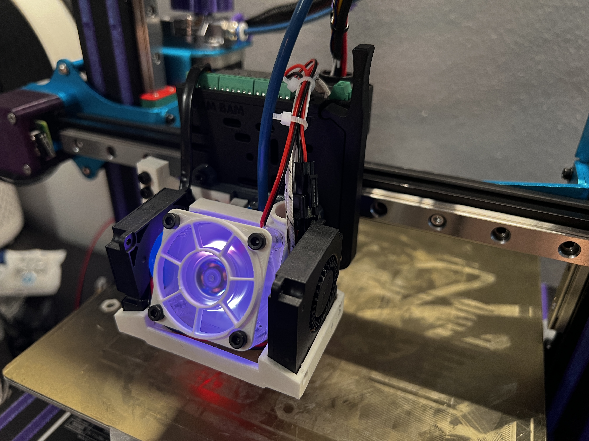
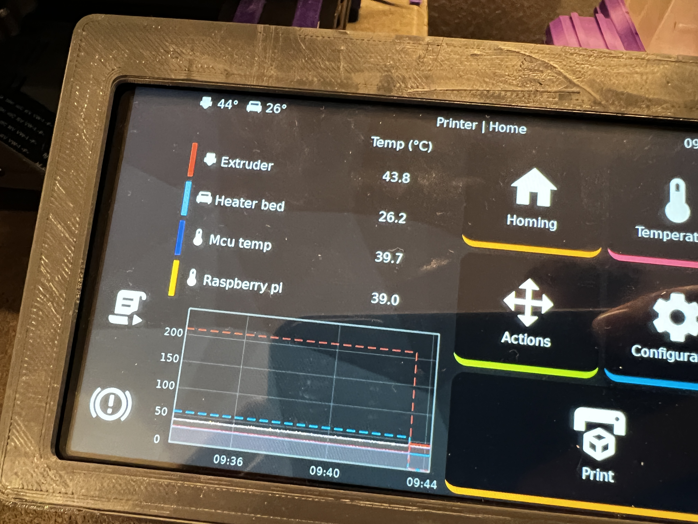

#  Voxelab Aquila G32 Klipper config

Current printer config:
- Firmware: Klipper 0.10.0
- MCU: G32 [STM32]
- Display: TFT50 running KlipperScreen
#
- Hotend Carriage: WhamBam Mutant v2 Hotswap Toolkit

- Hotend 1 setup:
    - HeroMe Gen6 Suite:
        - Voxelab BMS gantry plate adapter
        - dual 4010 blower duct
        - generic OEM BMS body
        - abs wing & mount - compact versions
    - Hotend: Phaetus Dragonfly BMS
#
- X Axis: Single MGN12 Linear Rail
- Y Axis: Double MGN12 Linear Rails
- Z Axis: Double MGN12 Linear Rails

#

KlipperScreen with extra temperature sensors:
